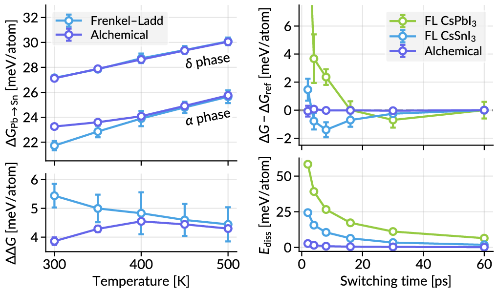

## My matplotlib preset
> *Flavored with [Lato fonts](https://www.latofonts.com) and [tailwindcss](https://tailwindcss.com) color palette!*

> [!CAUTION]
> This repository has been released as a preliminary version and may not be ready for production use. I'll work on refining colors and options in future updates.

### Installation on Linux
1. Download the Lato font from the [official website](https://www.latofonts.com/lato-free-fonts/) (do not install it from Google Fonts, as it is an older version).
2. On Linux, copy the ttf files to the `~/.local/share/fonts/` directory and run `fc-cache -fv ~/.local/share/fonts/` to update the font cache.
3. To use as the default matplotlib style, copy the `matplotlibrc` file to your `~/.config/matplotlib/` directory.

For other options, please refer to the [official documentation](https://matplotlib.org/stable/users/explain/customizing.html).

### Example figure

You may need to configure the marker sizes, line widths, etc. to fit your needs.

### More colors
See the [tailwindcss color palette](https://tailwindcss.com/docs/customizing-colors) for colorful inspiration!
